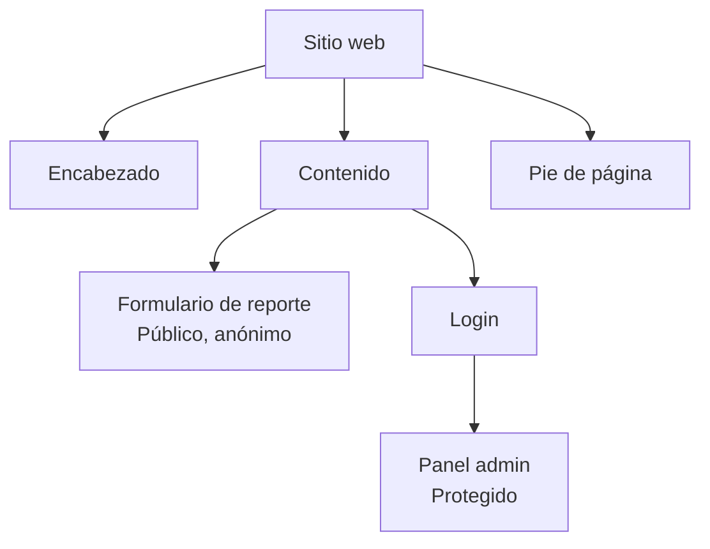
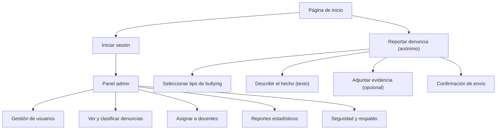

# Mapas del sitio web — Sistema de reporte anónimo de bullying

## Mapa de componentes

```mermaid
graph TD
    Sitio[Sitio web] --> Encabezado
    Sitio --> Contenido
    Sitio --> Pie["Pie de página"]

    Contenido --> Formulario["Formulario de reporte<br/>Público, anónimo"]
    Contenido --> Login
    Login --> PanelAdmin["Panel admin<br/>Protegido"]
```

## Mapa de usuario

```mermaid
graph TD
    Inicio["Página de inicio"] --> Reportar["Reportar denuncia (anónimo)"]
    Inicio --> LoginAdmin["Iniciar sesión"]
    LoginAdmin --> Panel["Panel admin"]

    Reportar --> Tipo["Seleccionar tipo de bullying"]
    Reportar --> Descripcion["Describir el hecho (texto)"]
    Reportar --> Evidencia["Adjuntar evidencia (opcional)"]
    Reportar --> Confirmacion["Confirmación de envío"]

    Panel --> Usuarios["Gestión de usuarios"]
    Panel --> Denuncias["Ver y clasificar denuncias"]
    Panel --> Asignar["Asignar a docentes"]
    Panel --> Reportes["Reportes estadísticos"]
    Panel --> Seguridad["Seguridad y respaldo"]
```
